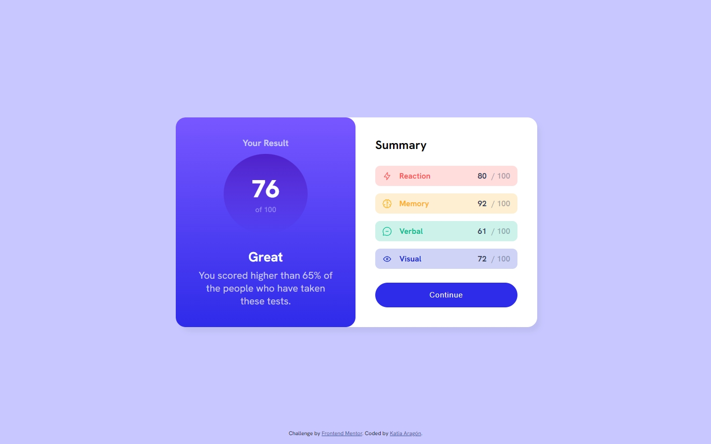
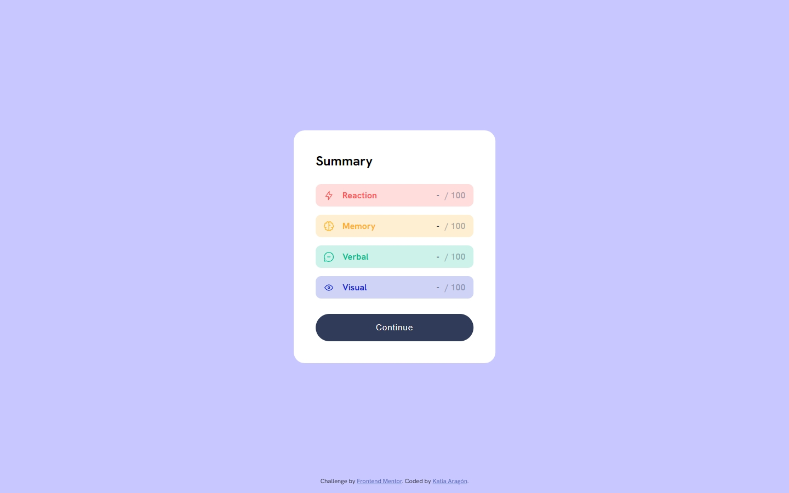
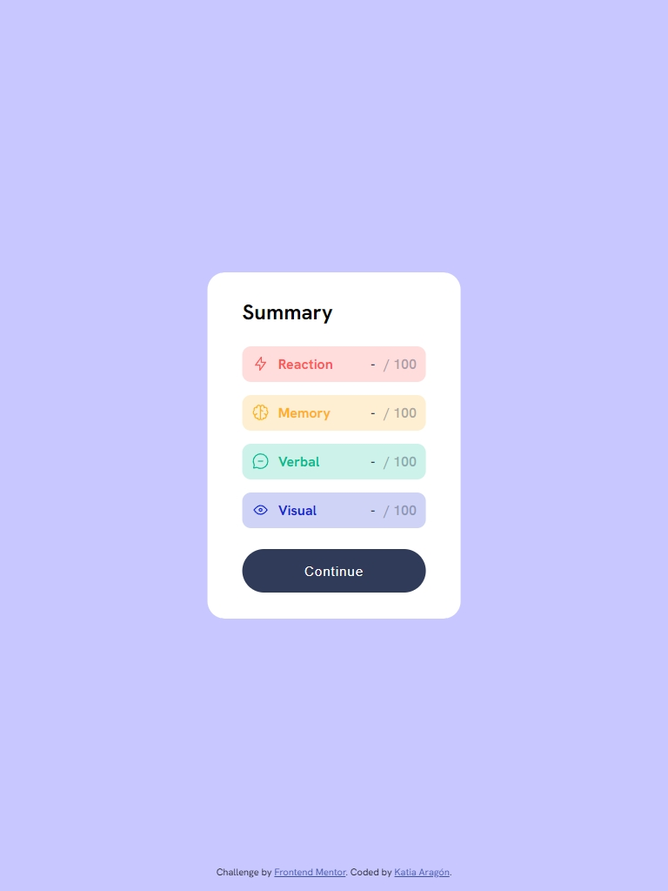
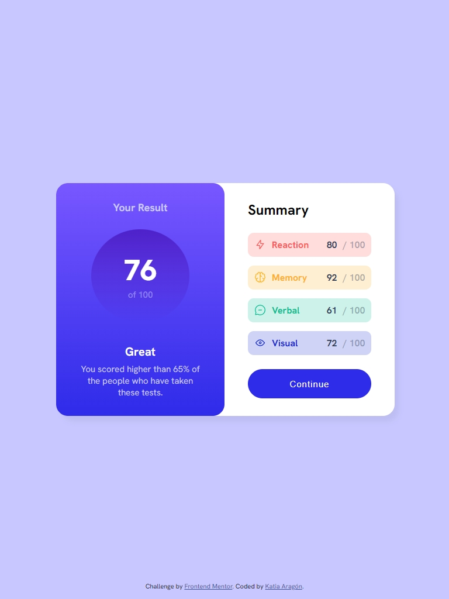
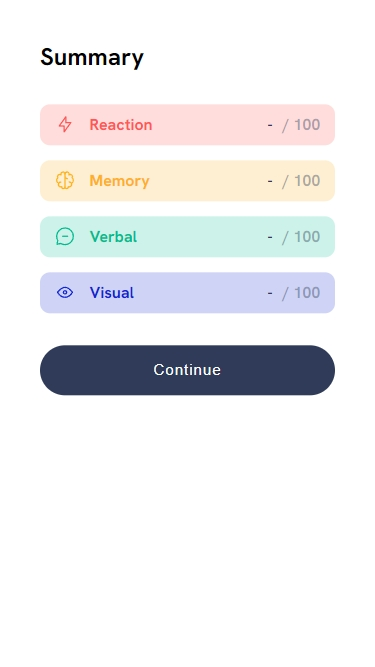
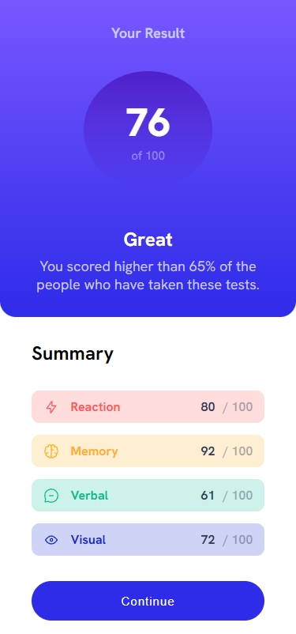

# Frontend Mentor - Results summary component solution

This is a solution to the [Results summary component challenge on Frontend Mentor](https://www.frontendmentor.io/challenges/results-summary-component-CE_K6s0maV). Frontend Mentor challenges help you improve your coding skills by building realistic projects.

## Table of contents

- [Overview](#overview)
- [Screenshot](#screenshot)
- [My process](#my-process)
  - [Built with](#built-with)

## Overview

Within this project users should be able to:

- View the optimal layout for the interface depending on their device's screen size
- See hover states for all interactive elements on the page

The programmer should:

- **Bonus**: Use the local JSON data to dynamically populate the content
- Use react to develop the page

### Screenshot

## My process

This was my first project using React. It was difficult; I was confused about when to use `useEffect` and when to use `useState`, and how to apply what I learned in JavaScript to the code. I did a lot of research on Google and made notes to better understand how to write code with this framework.

I had problems with page overflow in the mobile version, but in the end, I was able to solve it very easily, as well as implementing a timeout so that the average reveal wouldn't appear until the box was revealed.
I now understand a bit about how React works, and I think I like it; it's really practical to use.

### Built with

- React
- JavaScript
- SCSS
- HTML
